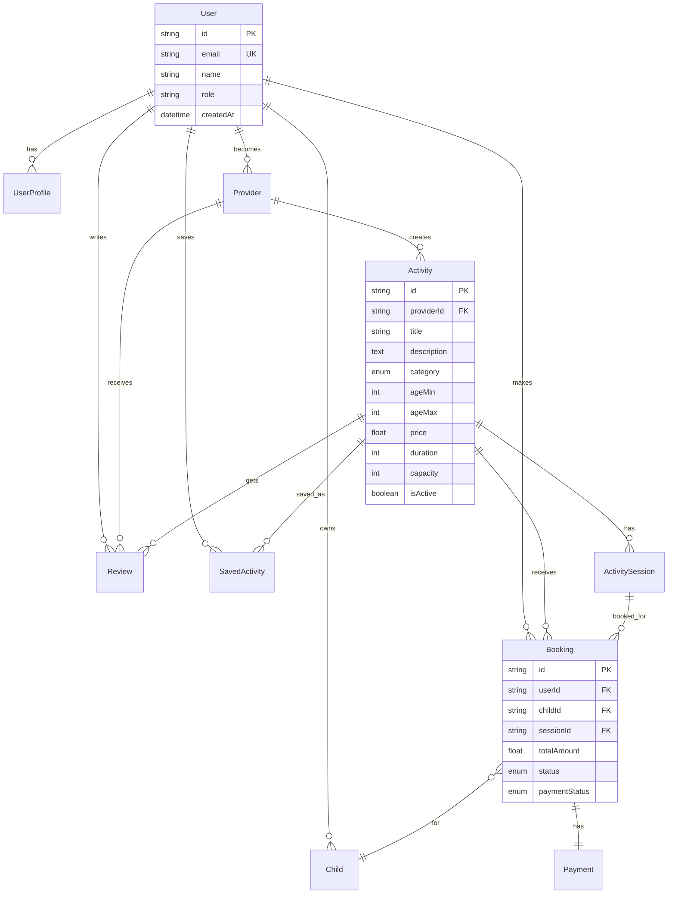

# Architecture Documentation

KidsHiz is built as a modern, scalable web application using Next.js 15 with a focus on performance, security, and maintainability.

## 🏗️ System Architecture

### High-Level Overview

```
┌─────────────────┐    ┌─────────────────┐    ┌─────────────────┐
│   Web Browser   │    │   Mobile App    │    │  Third-party    │
│                 │    │   (Future)      │    │  Integrations   │
└─────────┬───────┘    └─────────┬───────┘    └─────────┬───────┘
          │                      │                      │
          └──────────────────────┼──────────────────────┘
                                 │
                    ┌─────────────▼───────────────┐
                    │        Load Balancer        │
                    │         (Nginx)             │
                    └─────────────┬───────────────┘
                                 │
                    ┌─────────────▼───────────────┐
                    │      Next.js Application    │
                    │    (App Router + API)       │
                    └─────────────┬───────────────┘
                                 │
          ┌──────────────────────┼──────────────────────┐
          │                      │                      │
    ┌─────▼─────┐      ┌────────▼────────┐      ┌─────▼─────┐
    │PostgreSQL │      │     Redis       │      │Background │
    │ Database  │      │   (Cache &      │      │  Workers  │
    │           │      │    Queues)      │      │           │
    └───────────┘      └─────────────────┘      └───────────┘
```

### Technology Stack

#### Frontend
- **Next.js 15**: React framework with App Router
- **React 19**: UI library with concurrent features
- **TypeScript**: Type-safe development
- **Tailwind CSS**: Utility-first styling
- **Radix UI**: Accessible component primitives

#### Backend
- **Next.js API Routes**: Serverless API endpoints
- **NextAuth.js v5**: Authentication and authorization
- **Prisma**: Type-safe database ORM
- **Zod**: Runtime type validation

#### Database & Storage
- **PostgreSQL 16**: Primary database
- **Redis 7**: Caching and job queues
- **Cloudinary**: Image storage and optimization
- **Local Storage**: Fallback file storage

#### External Services
- **Stripe**: Payment processing
- **MBWay**: Portuguese payment method
- **Google Maps**: Location services
- **Sentry**: Error tracking and monitoring
- **SMTP**: Email delivery

## 🔧 Application Architecture

### Folder Structure

```
src/
├── app/                    # Next.js App Router
│   ├── (auth)/            # Authentication pages
│   ├── activities/        # Activity browsing & details
│   ├── admin/            # Admin dashboard
│   ├── api/              # API endpoints
│   ├── dashboard/        # User dashboards
│   ├── globals.css       # Global styles
│   ├── layout.tsx        # Root layout
│   └── page.tsx          # Homepage
├── components/           # Reusable components
│   ├── ui/              # UI primitives (buttons, inputs)
│   ├── forms/           # Form components
│   ├── layout/          # Layout components (header, nav)
│   ├── activities/      # Activity-specific components
│   ├── accessibility/   # A11y components
│   └── providers/       # Context providers
├── lib/                 # Utility libraries
│   ├── auth.ts         # Authentication configuration
│   ├── prisma.ts       # Database client
│   ├── stripe.ts       # Payment processing
│   ├── queue.ts        # Background job system
│   ├── monitoring.ts   # Error tracking & metrics
│   ├── email.ts        # Email service
│   └── utils.ts        # Utility functions
├── hooks/              # Custom React hooks
└── types/              # TypeScript type definitions
```

### Data Flow

#### Request Flow
1. **Client Request** → Load Balancer (Nginx)
2. **Load Balancer** → Next.js Application
3. **Middleware** → Authentication & Rate Limiting
4. **API Route** → Business Logic
5. **Database/Cache** → Data Retrieval
6. **Response** → Client

#### Authentication Flow
1. **User Login** → NextAuth.js
2. **OAuth/Credentials** → Provider Verification
3. **Session Creation** → JWT + Database Session
4. **Authorization** → Role-based Access Control

#### Payment Flow
1. **Booking Creation** → Pending Status
2. **Payment Intent** → Stripe API
3. **Client Payment** → Stripe/MBWay
4. **Webhook** → Payment Confirmation
5. **Booking Update** → Confirmed Status
6. **Email Notification** → Background Job

## 🗄️ Database Design

### Core Entities



### Key Design Decisions

1. **UUID Primary Keys**: Better for distributed systems and security
2. **Soft Deletes**: Maintain data integrity with `deletedAt` timestamps
3. **Audit Trails**: `createdAt`/`updatedAt` on all entities
4. **Referential Integrity**: Foreign key constraints with cascading
5. **Indexing Strategy**: Optimized for common query patterns

### Database Schema

#### Users & Authentication
- `User`: Core user information
- `Account`: OAuth account linking (NextAuth.js)
- `Session`: User sessions
- `VerificationToken`: Email verification tokens
- `UserProfile`: Extended user information

#### Business Entities
- `Provider`: Activity provider details
- `Activity`: Activity information and metadata
- `ActivitySession`: Scheduled activity instances
- `Child`: Child profiles for bookings
- `Booking`: Reservation records
- `Payment`: Payment transactions
- `Review`: User reviews and ratings

#### Supporting Tables
- `SavedActivity`: User's saved activities
- `Report`: Generated business reports

## 🔐 Security Architecture

### Authentication & Authorization

#### Multi-layered Security
1. **Transport Security**: HTTPS/TLS encryption
2. **Application Security**: NextAuth.js with JWT
3. **Database Security**: Connection encryption, access controls
4. **API Security**: Rate limiting, input validation

#### Role-Based Access Control (RBAC)

```typescript
enum Role {
  PARENT   // Can browse, book, manage children
  PROVIDER // Can create activities, manage bookings
  ADMIN    // Full system access
}
```

#### Permission Matrix

| Resource | Parent | Provider | Admin |
|----------|--------|----------|-------|
| Browse Activities | ✅ | ✅ | ✅ |
| Book Activities | ✅ | ❌ | ✅ |
| Create Activities | ❌ | ✅ | ✅ |
| View All Bookings | ❌ | Own Only | ✅ |
| Admin Dashboard | ❌ | ❌ | ✅ |

### Data Protection

#### GDPR Compliance
- **Data Minimization**: Only collect necessary data
- **Purpose Limitation**: Clear data usage policies
- **Storage Limitation**: Automatic data retention policies
- **User Rights**: Data export, deletion, modification

#### PCI DSS Compliance
- **No Card Storage**: Stripe handles sensitive data
- **Secure Transmission**: HTTPS for all communications
- **Access Controls**: Limited payment data access
- **Audit Logging**: All payment activities logged

### Input Validation & Sanitization

```typescript
// Example validation schema
const createBookingSchema = z.object({
  sessionId: z.string().cuid(),
  childId: z.string().cuid(),
  quantity: z.number().int().min(1).max(10),
  notes: z.string().max(500).optional()
});
```

## 🚀 Performance Architecture

### Caching Strategy

#### Multi-layer Caching
1. **CDN**: Static assets (images, CSS, JS)
2. **Application**: API responses, computed data
3. **Database**: Query result caching
4. **Browser**: Client-side caching

#### Cache Implementation
```typescript
// Redis caching with TTL
const cacheKey = `activities:${filters.hash}`;
const cached = await redis.get(cacheKey);
if (cached) return JSON.parse(cached);

const data = await database.query();
await redis.setex(cacheKey, 300, JSON.stringify(data));
```

### Database Optimization

#### Indexing Strategy
- **Primary Keys**: Clustered indexes on UUID
- **Foreign Keys**: Non-clustered indexes
- **Search Fields**: Composite indexes for filtering
- **Performance**: Query-specific indexes

#### Query Optimization
- **Connection Pooling**: Prisma connection pool
- **Query Planning**: EXPLAIN analysis
- **N+1 Prevention**: Eager loading with includes
- **Pagination**: Cursor-based for large datasets

### Application Performance

#### Code Splitting
- **Route-based**: Automatic with Next.js
- **Component-based**: Dynamic imports
- **Library-based**: Separate vendor bundles

#### Image Optimization
- **Next.js Image**: Automatic format conversion
- **Cloudinary**: Transformation and optimization
- **Lazy Loading**: Intersection Observer API
- **Progressive Enhancement**: Fallback support

## 🔄 Background Jobs Architecture

### Job Queue System

```typescript
// Job types and processing
interface JobData {
  type: JobType;
  payload: any;
  userId?: string;
  bookingId?: string;
}

// Queue implementation
const emailQueue = new Bull('email', { redis });
const paymentQueue = new Bull('payment', { redis });
const notificationQueue = new Bull('notification', { redis });
```

### Job Categories

1. **Email Jobs**: Confirmation, reminders, notifications
2. **Payment Jobs**: Processing, refunds, disputes
3. **Notification Jobs**: SMS, push notifications
4. **Maintenance Jobs**: Cleanup, data synchronization
5. **Report Jobs**: Analytics, business intelligence

### Error Handling & Retry Logic

```typescript
const jobOptions = {
  attempts: 3,
  backoff: {
    type: 'exponential',
    delay: 2000
  },
  removeOnComplete: 50,
  removeOnFail: 50
};
```

## 📊 Monitoring & Observability

### Error Tracking

#### Sentry Integration
- **Client Errors**: React Error Boundaries
- **Server Errors**: API route exceptions
- **Performance**: Transaction monitoring
- **User Context**: Session and user information

### Logging Strategy

#### Structured Logging
```typescript
logger.info('Payment processed', {
  userId: 'user-123',
  bookingId: 'booking-456',
  amount: 25.00,
  provider: 'stripe',
  duration: 1250
});
```

#### Log Levels
- **DEBUG**: Development debugging
- **INFO**: Normal operations
- **WARN**: Potential issues
- **ERROR**: Errors requiring attention

### Metrics Collection

#### Business Metrics
- Booking conversion rates
- Payment success rates
- User engagement metrics
- Provider performance

#### Technical Metrics
- API response times
- Database query performance
- Error rates by endpoint
- System resource usage

### Health Monitoring

#### Health Checks
- Application responsiveness
- Database connectivity
- External service availability
- Background job processing

## 🔧 Development Architecture

### Code Quality

#### Type Safety
- **TypeScript**: Compile-time type checking
- **Prisma**: Database type generation
- **Zod**: Runtime validation
- **ESLint**: Code quality rules

#### Testing Strategy
- **Unit Tests**: Jest + React Testing Library
- **Integration Tests**: API endpoint testing
- **E2E Tests**: Playwright browser testing
- **Performance Tests**: Load testing with k6

### Development Workflow

#### Git Workflow
```
main (production)
├── develop (staging)
│   ├── feature/user-dashboard
│   ├── feature/payment-integration
│   └── hotfix/security-patch
```

#### CI/CD Pipeline
1. **Code Commit** → GitHub
2. **Automated Tests** → GitHub Actions
3. **Code Quality** → ESLint, TypeScript
4. **Security Scan** → Snyk, CodeQL
5. **Build & Deploy** → Docker containers

## 🌐 Scalability Considerations

### Horizontal Scaling

#### Application Layer
- **Stateless Design**: No server-side state
- **Load Balancing**: Multiple app instances
- **CDN Distribution**: Global content delivery

#### Database Layer
- **Read Replicas**: Scale read operations
- **Connection Pooling**: Efficient connections
- **Query Optimization**: Performance tuning

### Vertical Scaling

#### Resource Optimization
- **Memory Management**: Efficient caching
- **CPU Optimization**: Async processing
- **Storage**: SSD for database performance

### Future Considerations

#### Microservices Migration
- **Payment Service**: Isolated payment processing
- **Notification Service**: Email/SMS handling
- **Analytics Service**: Metrics and reporting

#### Geographic Distribution
- **Multi-region**: EU-wide expansion
- **Data Localization**: GDPR compliance
- **Edge Computing**: Reduced latency

---

This architecture supports the current needs while providing a foundation for future growth and feature expansion.